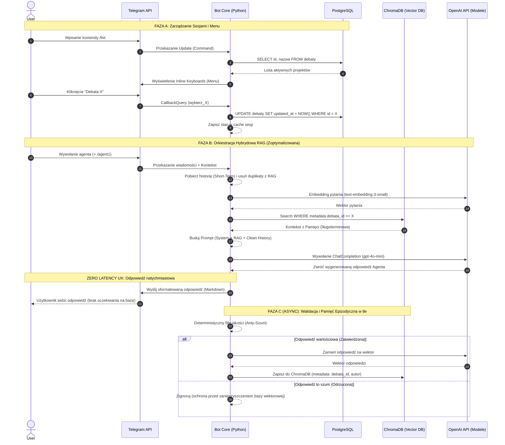

## Agentic Multi-Tenant RAG: 

Status: Active Development

## 💡 Zastosowania projektu 💡
Większość botów opartych na LLM gubi wątek w długich dyskusjach lub nie potrafi odnieść się do faktów sprzed tygodnia. Ten system rozwiązuje te problemy, oferując:

*   **Wirtualne Panele Eksperckie**: Możesz stworzyć debatę, w której uczestniczą agenci o różnych rolach (np. Architekt IT, Specjalista ds. Bezpieczeństwa), wspólnie analizując Twój problem (np. planowaną migrację bazy danych).
*   **Dynamiczna Baza Wiedzy Projektowej**: Dzięki pamięci epizodycznej RAG, bot staje się "żywym" archiwum projektu. Pamięta każdą kluczową decyzję i fakt z poprzednich sesji, eliminując potrzebę przeszukiwania tysięcy wiadomości.
*   **Weryfikacja Hipotez i Kontrargumentacja**: System pozwala na automatyczne generowanie kontrargumentów przez agentów, co pomaga wykryć luki w planach biznesowych lub technicznych jeszcze przed ich wdrożeniem .
*   **Separacja Wiedzy (Multi-Tenancy)**: Możesz prowadzić wiele niezależnych projektów jednocześnie. Bot gwarantuje, że dane z "Projektu A" nigdy nie wyciekną do odpowiedzi w "Projekcie B" .

---

##  Główne Cechy
*   **Architektura Multi-Agent**: System pozwala na interakcję z różnymi rolami agentów w ramach jednej debaty.
*   **Pamięć Epizodyczna (RAG)**: Wykorzystanie bazy wektorowej do przechowywania i przeszukiwania kontekstu historycznego wszystkich wypowiedzi.
*   **Mechanizm Multi-Tenancy**: Pełna separacja danych dzięki filtrowaniu metadanych (Metadata Filtering).
*   **Asynchroniczność**: Budowa oparta na `asyncio`, zapewniająca płynną obsługę wielu użytkowników jednocześnie.

## Architektura Systemu

### 1. Zarządzanie Stanem (postgreSQL)
Moduł odpowiada za trwałość sesji i strukturę biznesową:
*   **Tabela `debaty`**: Przechowuje UUID4 debaty, jej nazwę (np. "Migracja bazy danych") oraz znaczniki czasu.
*   **Tabela `bot_state`**: Mapuje użytkowników Telegrama do ich aktywnych sesji, zapewniając trwałość po restarcie .

### 2. Silnik Wyszukiwania Semantycznego (ChromaDB)
System pamięci długoterminowej bota:
*   **Model Wektorowy**: `text-embedding-3-small` (1536 wymiarów), zoptymalizowany pod kątem polskiej terminologii technicznej .
*   **Algorytm**: HNSW dla błyskawicznego przeszukiwania poddrzew wektorów spełniających warunek `debata_id` .
*   **Chunking**: Każda zwięzła odpowiedź agenta stanowi jeden dokument (chunk), co upraszcza strukturę danych.

### 3. Orkiestracja Agentów i Prompt Engineering
Sercem systemu jest model `gpt-4o-mini`, który przetwarza hybrydowy prompt użytkownika:
*   **Izolacja XML**: Dane w prompcie są separowane znacznikami (np. `<rag_retrieval>`, `<short_term_memory>`), co zwiększa precyzję odpowiedzi [1].
*   **Instrukcje Ról**: Agenci są instruowani, aby odpowiadać krótko (max 3 zdania) i unikać powtarzania faktów już obecnych w pamięci.

### 4. Interfejs Telegram (python-telegram-bot)
*   **/start** – inicjalizacja i instrukcja.
*   **/nowa <nazwa>** – tworzenie nowej sesji.
*   **/list** – dynamiczna lista debat z interaktywnymi przyciskami .
*   **Przepływ CallbackQuery**: Pozwala na dynamiczną zmianę widoku z listy debat na listę dostępnych agentów .

### Diagramy przepływu danych:





```mermaid

sequenceDiagram
    autonumber
    
    participant O as Orkiestrator (Główny Sędzia)
    
    %% Bezpieczny, przezroczysty kolor dla grupy
    box rgba(128, 128, 128, 0.2) Środowisko Agentowe
        participant A1 as Agent Analityk (Proposer)
        participant A2 as Agent Krytyk (Reviewer)
    end
    
    participant CH as ChromaDB (Wektory)
    participant LLM as OpenAI API

    Note over O, LLM: START DEBATY (Kontekst: Zapytanie Użytkownika)
    
    O->>A1: Zlecenie: "Przygotuj wstępną analizę"
    
    %% Faza Badawcza Agenta 1
    A1->>CH: Szukaj faktów (RAG - WHERE tenant_id = X)
    CH-->>A1: Wyciągnięte dokumenty
    A1->>LLM: Generuj Draft v1 (System Prompt + Dokumenty)
    LLM-->>A1: Wstępna Odpowiedź (Draft v1)
    A1->>O: Przekazanie Draftu v1
    
    %% Zamknięta Pętla Debaty
    loop Sesja Debaty (Max 3 Iteracje)
        O->>A2: Zlecenie: "Zweryfikuj Draft vN na podstawie faktów"
        A2->>LLM: Analiza krytyczna (Logika + Zgodność z RAG)
        LLM-->>A2: Raport z błędów / Ocena
        A2->>O: Wynik audytu (Uwagi Krytyka)
        
        alt Pełna zgoda (Brak uwag)
            %% Poprawiony blok break - akcja jest wewnątrz
            break Konsensus osiągnięty
                O-->>O: Przerwanie pętli (Early Exit)
            end
        else Brak zgody (Wymagane poprawki)
            O->>A1: Zlecenie: "Popraw błędy na podstawie uwag Krytyka"
            A1->>LLM: Generuj nową wersję (Draft vN+1)
            LLM-->>A1: Poprawiona odpowiedź
            A1->>O: Przekazanie zaktualizowanego Draftu
        end
    end
    
    Note over O, LLM: FAZA PODSUMOWANIA (Forced Resolution)
    O-->>O: Kompilacja transkrypcji debaty (Zapisy z iteracji)
    O->>LLM: Wywołanie jako Sędzia: "Zbuduj finalne podsumowanie i wskaż ostateczne fakty"
    LLM-->>O: Ostateczny Raport (Wnioski z debaty)
    
    Note over O, LLM: KONIEC DEBATY
    O-->>O: [Przekazanie raportu do wysyłki w Telegramie i asynchronicznego zapisu]

```RAGent
