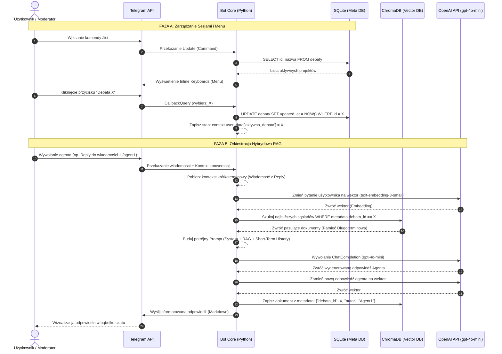

# Architektura systemu Debat Analitycznych w bazach wektorowych

Orkiestracja wielu agentów oraz system **RAG (Retrieval-Augmented Generation)** do prowadzenia merytorycznych debat i zarządzania wiedzą w czasie rzeczywistym.

## Główne Cechy
*   **Architektura Multi-Agent**: System pozwala na interakcję z różnymi rolami agentów w ramach jednej debaty.
*   **Pamięć Epizodyczna (RAG)**: Wykorzystanie bazy wektorowej do przechowywania i przeszukiwania kontekstu historycznego wszystkich wypowiedzi.
*   **Mechanizm Multi-Tenancy**: Pełna separacja danych pomiędzy różnymi debatami dzięki filtrowaniu metadanych (Metadata Filtering).
*   **Asynchroniczność**: Budowa oparta na `asyncio`, zapewniająca płynną obsługę wielu użytkowników jednocześnie.

## Architektura Systemu

### 1. Zarządzanie Stanem (SQLite)
Moduł odpowiada za trwałość sesji i strukturę biznesową projektów:
*   **Tabela `debaty`**: Przechowuje UUID4 debaty, jej nazwę oraz znaczniki czasu.
*   **Tabela `bot_state`**: Mapuje użytkowników Telegrama do ich aktywnych sesji.

### 2. Silnik Wyszukiwania Semantycznego (ChromaDB)
System pamięci długoterminowej bota .
*   **Model Wektorowy**: `text-embedding-3-small` (1536 wymiarów), zoptymalizowany pod kątem polskiej terminologii technicznej.
*   **Algorytm**: HNSW (Hierarchical Navigable Small World) dla błyskawicznego przeszukiwania poddrzew wektorów spełniających warunek `debata_id` .
*   **Chunking**: Każda zwięzła odpowiedź agenta stanowi jeden integralny dokument (chunk).

### 3. Orkiestracja Agentów i Prompt Engineering
Sercem systemu jest model `gpt-4o-mini`, który przetwarza hybrydowy prompt użytkownika :
*   **Hybrydowa Pamięć**: Łączy kontekst długoterminowy ([CONTEXT_LONG_TERM] z bazy RAG) z kontekstem krótkoterminowym ([CONTEXT_SHORT_TERM] – ostatnia wiadomość) 
*   **Izolacja XML**: Dane w prompcie są separowane znacznikami XML, co zwiększa precyzję odpowiedzi

### 4. Interfejs Telegram (python-telegram-bot)
Zapewnia intuicyjne sterowanie za pomocą komend i przycisków:
*   `/start` – inicjalizacja i instrukcja.
*   `/nowa <nazwa>` – tworzenie nowej sesji debaty.
*   `/list` – dynamiczna lista debat z interaktywnymi przyciskami `InlineKeyboardMarkup`.
*   **Przepływ CallbackQuery**: Pozwala na dynamiczną zmianę widoku z listy debat na listę dostępnych agentów w ramach wybranego projektu

## 🛠 Technologia
*   **Language**: Python (Asyncio) 
*   **LLM**: OpenAI GPT-4o-mini
*   **Embeddings**: text-embedding-3-small
*   **Vector DB**: ChromaDB
*   **Relational DB**: SQLite 
*   **Deployment**: Docker & Docker Compose

#Diagram przepływu danych:

USER<-->TelegramBot<-->DBs<-->LLM API

