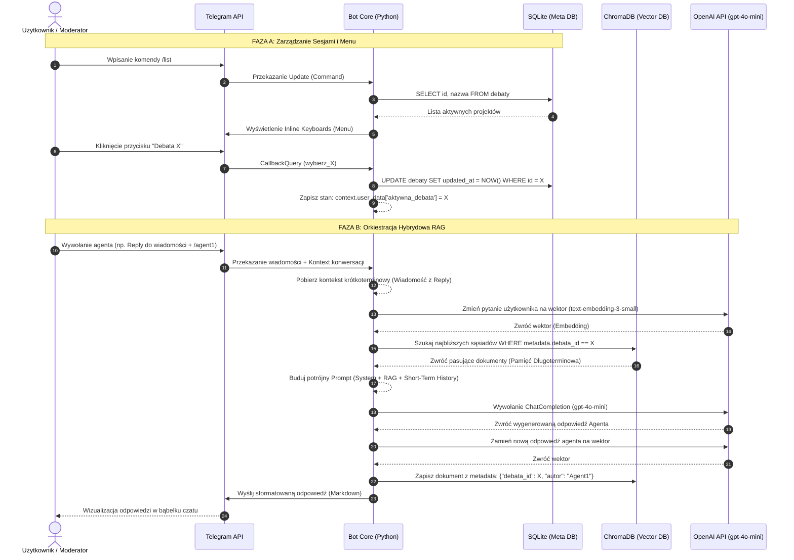

# RAGent
Scalable Multi-tenant Agentic RAG Technology
# Architektura Systemu - RAG & Telegram Bot

Poniższy diagram przedstawia przepływ danych 

USER<-->TelegramBot<-->DBs<-->LLM API

```mermaid
sequenceDiagram
    autonumber
    actor U as Użytkownik / Moderator
    participant TG as Telegram API
    participant B as Bot Core (Python)
    participant SQL as SQLite (Meta DB)
    participant CH as ChromaDB (Vector DB)
    participant AI as OpenAI API (gpt-4o-mini)

    %% Sekcja 1: Zarządzanie Debatami
    Note over U, SQL: FAZA A: Zarządzanie Sesjami i Menu
    U->>TG: Wpisanie komendy /list
    TG->>B: Przekazanie Update (Command)
    B->>SQL: SELECT id, nazwa FROM debaty
    SQL-->>B: Lista aktywnych projektów
    B->>TG: Wyświetlenie Inline Keyboards (Menu)
    U->>TG: Kliknięcie przycisku "Debata X"
    TG->>B: CallbackQuery (wybierz_X)
    B->>SQL: UPDATE debaty SET updated_at = NOW() WHERE id = X
    B-->>B: Zapisz stan: context.user_data['aktywna_debata'] = X

    %% Sekcja 2: Wywołanie Agenta i RAG
    Note over U, AI: FAZA B: Orkiestracja Hybrydowa RAG
    U->>TG: Wywołanie agenta (np. Reply do wiadomości + /agent1)
    TG->>B: Przekazanie wiadomości + Kontext konwersacji
    B-->>B: Pobierz kontekst krótkoterminowy (Wiadomość z Reply)
    
    %% Retrieval
    B->>AI: Zmień pytanie użytkownika na wektor (text-embedding-3-small)
    AI-->>B: Zwróć wektor (Embedding)
    B->>CH: Szukaj najbliższych sąsiadów WHERE metadata.debata_id == X
    CH-->>B: Zwróć pasujące dokumenty (Pamięć Długoterminowa)
    
    %% Augmentation & Generation
    B-->>B: Buduj potrójny Prompt (System + RAG + Short-Term History)
    B->>AI: Wywołanie ChatCompletion (gpt-4o-mini)
    AI-->>B: Zwróć wygenerowaną odpowiedź Agenta
    
    %% Ingest
    B->>AI: Zamień nową odpowiedź agenta na wektor
    AI-->>B: Zwróć wektor
    B->>CH: Zapisz dokument z metadata: {"debata_id": X, "autor": "Agent1"}
    
    %% Odpowiedź do użytkownika
    B->>TG: Wyślij sformatowaną odpowiedź (Markdown)
    TG-->>U: Wizualizacja odpowiedzi w bąbelku czatu
```
